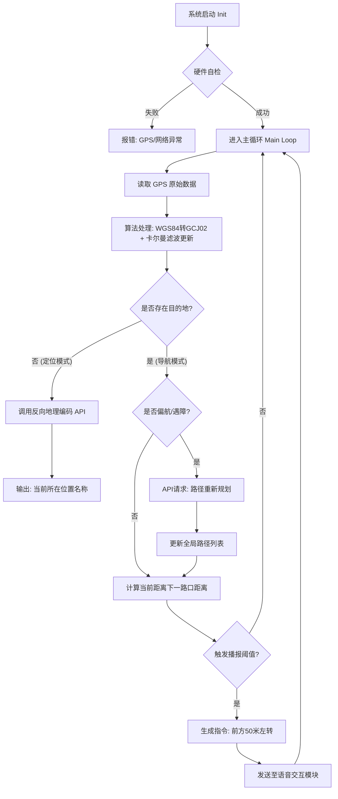

## 1. 模块综述

本导航模块基于嵌入式 Linux 架构，集成 GNSS 硬件与云端地图服务，为使用者提供室外米级定位、路径规划及实时导航，强调低延迟、高容错性以及与视觉避障模块的动态联动能力。

---

## 2. 系统架构

### 2.1 核心逻辑

1.  感知: 通过 USB-GNSS 接收机解析 NMEA-0183 协议数据，获取原始经纬度。
2.  计算: 在边缘设备执行坐标系转换、卡尔曼滤波，消除漂移，预测轨迹。
3.  云服务: 通过 API 交互（高德/百度/或开源平台），完成反向地理编码与路径规划。
4.  控制: 结合实时位置与路径航点，生成自然语言指令，分发至语音模块。

### 2.2 流程图

---
## 3. 关键算法

### 3.1 坐标系纠偏
*   问题: 国际 GPS 输出 WGS-84 坐标，而中国境内合规地图数据强制使用 GCJ-02 坐标。直接叠加会导致非线性偏移。
*   解决: 采用非线性保密映射算法。
*   实现: 引入 eviltransform 库，在边缘端实时计算，确保发送给 API 的坐标精准落在地图道路上。

### 3.2 半正矢测距
*   用途: 计算地球球面上两点间的最短距离，用于判定用户是否到达路口。
*   公式:
    $$ d = 2r \arcsin\left(\sqrt{\sin^2\left(\frac{\Delta\phi}{2}\right) + \cos(\phi_1)\cos(\phi_2)\sin^2\left(\frac{\Delta\lambda}{2}\right)}\right) $$
*   **工程意义:** 相比欧氏距离计算，能够消除地球曲率带来的误差。

### 3.3 卡尔曼滤波
*   问题: 由于高斯白噪声和多径效应，简单的均值滤波会导致路径滞后，且无法应对信号丢失。
*   解决: 引入线性卡尔曼滤波器。
*   原理: 建立包含“位置”和“速度”的状态向量，通过预测和更新两个步骤动态修正定位结果。
    *   *状态预测方程:* $\hat{x}_{k|k-1} = F_k \hat{x}_{k-1|k-1}$
    *   *状态更新方程:* $\hat{x}_{k|k} = \hat{x}_{k|k-1} + K_k (z_k - H \hat{x}_{k|k-1})$
*   **工程意义:** 
     1. 平滑轨迹: 即使 GPS 数据剧烈跳变，也能输出平滑的运动路径。
     2. 航位推算: 当经过树荫或遮挡导致瞬间丢星时，利用滤波器的速度分量进行短时位置预测，保证导航连续性。
---

## 4. 模块关联
* 与视觉模块：导航模块负责宏观路径，视觉模块负责微观避障（躲避路径上的行人和障碍）。当视觉模块检测到无法通行时，发送中断信号，导航模块进行重规划。

* 与语音交互模块： 语音模块解析用户自然语言，将结构化文本输入给导航模块；导航模块计算路径指引，以文本形式输出给语音模块。

* 与无线通信模块： 本导航模块并不在本地存储庞大的离线地图数据，而是通过无线通信模块实时调用高德/百度地图开放平台的 API 接口。

---

## 5. 未来扩展性

### 5.1 RTK 
*   现状: 现有单点 GPS 精度以米为量级，可能无法区分主路与辅路等。
*   升级: 接入 RTK 差分定位模块。通过网络获取基站差分数据，提高定位精度。
*   软件变动: 只需要修改 GPS 数据解析层，上层的代码逻辑保留。
### 5.2 IMU 惯性导航
*   现状: 进入隧道、地下通道或商场内部时，GPS 信号丢失，单一传感器导航中断。
*   升级: 引入 IMU (惯性测量单元)。将线性卡尔曼滤波器升级为扩展卡尔曼滤波。
*   实现: 实现 GNSS + IMU 的多传感器数据融合。利用 IMU 的高频更新修正 GPS 的低频延迟，并在无 GPS 信号时进行航位推算。

### 5.3 SLAM 
*   远期规划: 结合激光雷达或视觉里程计。
*   价值: 实现无 GPS 环境下的室内导航。导航模块不仅仅依赖经纬度，而是根据构建的局部地图进行定位，实现点到点的引导。
