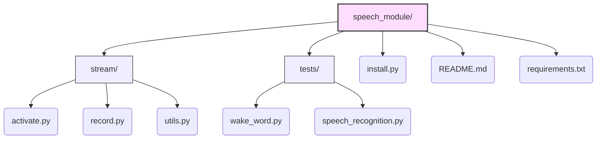

## Auto Speech Recognition Module
### Introduction
This is a simple implementation of OpenAI's speech-to-text model [whisper-base](https://huggingface.co/openai/whisper-base). Due to hardware limitation, we adopted the [openvino_genai pipeline](https://github.com/openvinotoolkit/openvino.genai/tree/master/samples/python/whisper_speech_recognition) and added a "wake-word" detection based on [porcupine](https://github.com/Picovoice/porcupine) together with [cobra](https://github.com/Picovoice/cobra)
### Hierarchy

***
Download wake_word.py to try "keyword wake up".

Download speech_recognition.py to try ASR.